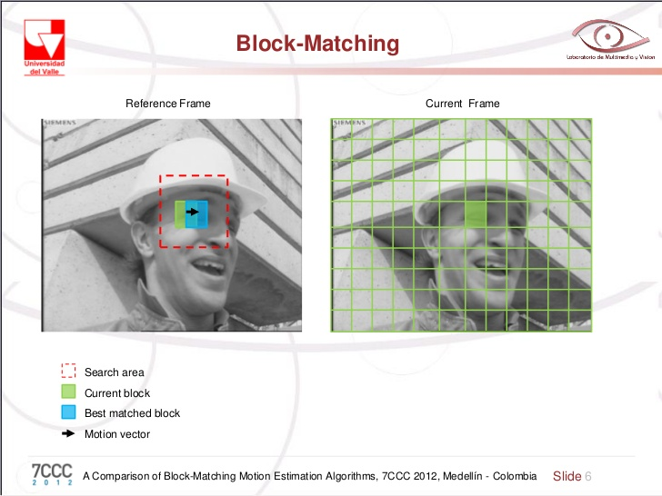
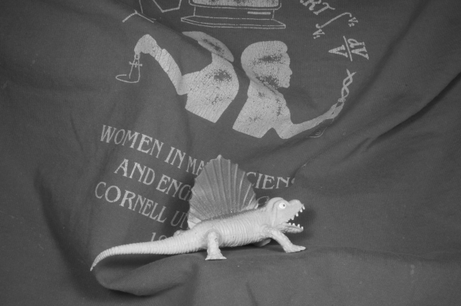
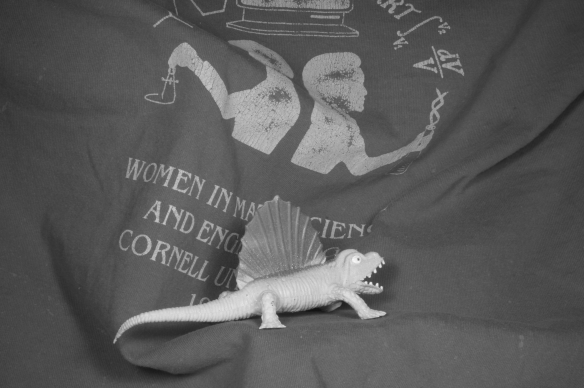

---
jupyter:
  jupytext:
    text_representation:
      extension: .md
      format_name: markdown
      format_version: '1.3'
      jupytext_version: 1.13.8
  kernelspec:
    display_name: Python 3
    language: python
    name: python3
---

# Presentation at Department meeting February 18th 2021

## Analyzing motion in cardiac MPS data

## human induced Pluripotent Stem Cells (hiPSC) can be used in personalized drug screening

>Translation of Human-Induced Pluripotent Stem Cells Nazish Sayed, Chun Liu,
>Joseph C. Wu Journal of the American College of Cardiology May 2016, 67 (18) 2161-2176


## MicroPhysiological Systems (MPS) mimics the in vitro conditions

> Tveito, A., Jæger, K.H., Huebsch, N., Charrez, B., Edwards, A.G., Wall, S. and Healy, K.E., 2018. Inversion and computational maturation of drug response using human stem cell derived cardiomyocytes in microphysiological systems. Scientific reports, 8(1), p.17626.


We want to quantifiy the motion of the cells in the chip. Why?


- Contractile motion is an important biomarker
- Several drugs alter the contractile properties and this is something we want to measure.
- Provides data for parameterizing mechancal models of IPS cells.


**Warning** - There will be some code in this presentation 🤓

```python
import mps
import numpy as np
import matplotlib.pyplot as plt
from pathlib import Path
path = Path("/Users/henriknf/local/src/mps_motion/demo/PointH4A_ChannelBF_VC_Seq0018.nd2")
data = mps.MPS(path)
```

```python
video = Path("brightfield.mp4")
mps.utils.frames2mp4(data.frames.T, video, framerate=data.framerate)
```

```python
from IPython.display import Video
Video(video, width=800, html_attributes="controls loop")
```


## What type of data do we have?

```python
print("width, height, num_timepoints = ", data.frames.shape)
print(data.info)
```


## Can we say something about how much a pixel moved from frame $i$ to frame $j$ ?

```python
%matplotlib inline
import matplotlib.pyplot as plt
fig, ax = plt.subplots(1, 2, figsize=(12, 12))
frame0 = data.frames[400:650, 350:700, 0]
frame70 = data.frames[400:650, 350:700, 70]

ax[0].imshow(frame0)
ax[0].set_title("Frame 0")

ax[1].imshow(frame70)
ax[1].set_title("Frame 70")

for axi in ax:
    axi.grid()

plt.show()
```

```python slideshow={"slide_type": "slide"}
plt.imshow(frame70 - frame0)
```


## Block matching



1. Divide images into macro blocks and decide on size of search area
2.

```
  For each block:
    For each location in the search area:
      Compute a similarity (mean square error)
    Find the block inside the search area with the best
    similarity measure and collect the motion vector
```

```python slideshow={"slide_type": "slide"}
import matplotlib as mpl

x_start = 80
dx = 8
y_start = 80
dy = 8

reference_block = frame0[x_start:x_start + dx, y_start:y_start + dy]
search_x = search_y = 10

fig, ax = plt.subplots(1, 2, figsize=(12, 6))
ax[0].imshow(frame0)
search = mpl.patches.Rectangle(
    (y_start - search_y, x_start-search_x),
    dy + 2 * search_y, dx + 2 * search_x, facecolor="magenta",
    alpha=0.2,
)
ax[0].add_patch(search)
block = mpl.patches.Rectangle(
    (y_start, x_start), dy, dx, facecolor="red",
    alpha=0.8,
)
ax[0].add_patch(block)

ax[1].imshow(reference_block)
```

```python slideshow={"slide_type": "slide"}
import numpy as np

min_err = np.inf
best_block = None
u = None
v = None
for i, xi in enumerate(range(x_start - search_x, x_start + dx + search_x)):
    for j, yj in enumerate(range(y_start - search_y, y_start + dy + search_y)):
        current_block = frame70[xi:xi+dx, yj:yj+dy]
        err = np.sum(np.abs(reference_block - current_block))
        if err < min_err:
            best_block = current_block
            min_err = err
            u = xi - x_start
            v = yj - y_start

print(f"(u, v) = ({u}, {v})")
fig, ax = plt.subplots(1, 2)
ax[0].imshow(reference_block)
ax[1].imshow(best_block)
plt.show()
```


### Assumptions

- Objects are only translated (not deformed)
- No change in illumination or noise
- Translations are small (within search region)

```python slideshow={"slide_type": "slide"}
from mps_motion.block_matching import flow
block_motion = flow(frame0, frame70, block_size=3, max_block_movement=18, filter_kernel_size=5)

# Plot
vmin = -10
vmax = 10
fig, ax = plt.subplots(1, 3, figsize=(12, 8), sharex=True, sharey=True)
ax[0].imshow(block_motion[:, :, 0], vmin=vmin, vmax=vmax)
ax[1].imshow(block_motion[:, :, 1], vmin=vmin, vmax=vmax)
im = ax[2].imshow(np.linalg.norm(block_motion, axis=2), vmin=vmin, vmax=vmax)
for axi, title in zip(ax, ["X", "Y", "Norm"]):
    axi.set_title(title)
cbar = fig.colorbar(im, ax=ax.ravel().tolist(), orientation='horizontal')
cbar.set_label("Pixel displacement")
plt.show()
```

```python
times = {}
from mps_motion.block_matching import flow, filter_vectors
times["block matching"] = %timeit -o flow(frame0, frame70, block_size=9, max_block_movement=18, filter_kernel_size=0)
```


## The optical flow equation

Let $I(x, y, t)$ denote the image sequence at position $(x, y)$ and time $t$.


Assume that at some later time $t + \Delta t$ the pixel at $(x, y)$ has moved to $(x + \Delta x, y + \Delta y)$.


\begin{align} I(x, y, t)
&= I(x + \Delta x, y + \Delta y, t + \Delta t) \\
&\approx I(x, y, t) + \frac{\partial I}{\partial x}\Delta x + \frac{\partial I}{\partial y}\Delta y + \frac{\partial I}{\partial t}\Delta t
\end{align}


\begin{align}
\frac{\partial I}{\partial x}\Delta x + \frac{\partial I}{\partial y}\Delta y + \frac{\partial I}{\partial t}\Delta t = 0
\end{align}


Divide by $\Delta t$ and let $\Delta t \rightarrow 0$ gives us the optical flow equation


\begin{align}
\frac{\partial I}{\partial x} V_x + \frac{\partial I}{\partial y} V_y = \nabla I \cdot \vec{V} = - \frac{\partial I}{\partial t}
\end{align}


$V_x$ and $V_y$ are unknown. We need one more equation!


### Image gradient

```python
I_x, I_y = np.gradient(frame0)

fig, ax = plt.subplots(1, 2, figsize=(10, 8))
ax[0].imshow(I_x)
ax[0].set_title("$I_x$")
ax[1].imshow(I_y)
ax[1].set_title("$I_y$")
plt.show()
```


### The Lucas–Kanade method

Assumption: Flow is essentially constant in a local neighbourhood of the pixel under consideration


Consider a pixel $(x, y)$ and select a $5 \times 5$ window around this pixel (i.e 25 pixels).

$$
\begin{pmatrix}
I_x(p_1) & I_y(p_1) \\
\vdots & \vdots \\
I_x(p_{25}) & I_y(p_{25}) \\
\end{pmatrix}
\begin{pmatrix}
V_x \\
V_y \\
\end{pmatrix}
= - \begin{pmatrix}
I_t(p_1) \\
\vdots \\
I_t(p_{25})\\
\end{pmatrix}
\\
$$
or
$$ A v = b $$


solve least square problem
$$ A^T A v = A^Tb$$

```python slideshow={"slide_type": "slide"}
from mps_motion.lucas_kanade import flow
lk_motion = flow(frame0, frame70, step=2, winSize=(15, 15))


# Plot
vmin = -10
vmax = 10
fig, ax = plt.subplots(1, 3, figsize=(12, 8), sharex=True, sharey=True)
ax[0].imshow(lk_motion[:, :, 0], vmin=vmin, vmax=vmax)
ax[1].imshow(lk_motion[:, :, 1], vmin=vmin, vmax=vmax)
im = ax[2].imshow(np.linalg.norm(lk_motion, axis=2), vmin=vmin, vmax=vmax)
for axi, title in zip(ax, ["X", "Y", "Norm"]):
    axi.set_title(title)
cbar = fig.colorbar(im, ax=ax.ravel().tolist(), orientation='horizontal')
cbar.set_label("Pixel displacement")
plt.show()
```


### How about performance?

```python slideshow={"slide_type": "fragment"}
from mps_motion.lucas_kanade import flow
times["lucas kanade"] = %timeit -o flow(frame0, frame70, step=5, winSize=(15, 15), interpolate=False)
```


## Dense optical flow methods

### Farnebäck's method
Farnebäck, G. (2003, June). Two-frame motion estimation based on polynomial expansion. In Scandinavian conference on Image analysis (pp. 363-370). Springer, Berlin, Heidelberg.


Assumption: image can locally approximated by a quadratic polynomial


Let $\mathbf{x} = (x \; y)$ be a pixel coordinate, then we assumate that the reference image can be represented as

$$I(x, y, t_1) = f_1(\mathbf{x}) = \mathbf{x}^T A_1 \mathbf{x} + b_1^T \mathbf{x} + c_1$$


At a later time $\mathbf{x}$ has moved to $\mathbf{x} - \mathbf{d}$ so we can write the current image as


\begin{align}
I(x, y, t_2) &= f_2(\mathbf{x}) = f_1(\mathbf{x} - \mathbf{d}) \\
&= (\mathbf{x} - \mathbf{d})^T A_1 (\mathbf{x} - \mathbf{d})  + b_1^T (\mathbf{x} - \mathbf{d}) + c_1 \\
&= \mathbf{x}^T A_1 \mathbf{x} + (b_1 - 2A_1 \mathbf{d})^T \mathbf{x} + c_1 +\mathbf{d}^TA\mathbf{d} - b_1^T\mathbf{d}
\end{align}


$$f_2(\mathbf{x}) = \mathbf{x}^T A_2 \mathbf{x} + b_2^T \mathbf{x} + c_2$$

$$ \implies b_2 = b_1 - 2A_1 \mathbf{d} \; \land \; A_1 = A_2 $$
$$ \implies \mathbf{d} = A_1^{-1} \Delta b, \;\; \Delta b = -\frac{1}{2}(b_2 - b_1) $$


In practice we let $A(\mathbf{x}) = \frac{1}{2}(A_1(\mathbf{x}) + A_2(\mathbf{x)})$, perform a polynomial expansion of the two images, and solve the least square problem

$$
\min_{\mathbf{d}} \sum_{\Delta x \in I}w(\Delta x) \| A(\mathbf{x} + \Delta \mathbf{x}) \mathbf{d}(\mathbf{x}) - \Delta b (\mathbf{x}) \|^2
$$

$$
\mathbf{d} = \left( \sum w A^TA \right)^{-1} \sum w A^T \Delta b
$$

```python slideshow={"slide_type": "slide"}
from mps_motion.farneback import flow
farneback_motion = flow(frame0, frame70)

# Plot
vmin = -10
vmax = 10
fig, ax = plt.subplots(1, 3, figsize=(12, 8), sharex=True, sharey=True)
ax[0].imshow(farneback_motion[:, :, 0], vmin=vmin, vmax=vmax)
ax[1].imshow(farneback_motion[:, :, 1], vmin=vmin, vmax=vmax)
im = ax[2].imshow(np.linalg.norm(farneback_motion, axis=2), vmin=vmin, vmax=vmax)
for axi, title in zip(ax, ["X", "Y", "Norm"]):
    axi.set_title(title)
cbar = fig.colorbar(im, ax=ax.ravel().tolist(), orientation='horizontal')
cbar.set_label("Pixel displacement")
plt.show()
```

```python
from mps_motion.farneback import flow
times["farneback"] = %timeit -o flow(frame0, frame70)
```


### Dual TV-L 1
ZACH, Christopher; POCK, Thomas; BISCHOF, Horst. A duality based approach for realtime tv-l 1 optical flow. In: Joint pattern recognition symposium. Springer, Berlin, Heidelberg, 2007. p. 214-223.


Variational approach which minimizes some functional subject to the optical flow constraint.

```python slideshow={"slide_type": "slide"}
from mps_motion.dualtvl10 import flow
dualtvl1_motion = flow(frame0, frame70)


# Plot
vmin = -10
vmax = 10
fig, ax = plt.subplots(1, 3, figsize=(12, 8), sharex=True, sharey=True)
ax[0].imshow(dualtvl1_motion[:, :, 0], vmin=vmin, vmax=vmax)
ax[1].imshow(dualtvl1_motion[:, :, 1], vmin=vmin, vmax=vmax)
im = ax[2].imshow(np.linalg.norm(dualtvl1_motion, axis=2), vmin=vmin, vmax=vmax)
for axi, title in zip(ax, ["X", "Y", "Norm"]):
    axi.set_title(title)
cbar = fig.colorbar(im, ax=ax.ravel().tolist(), orientation='horizontal')
cbar.set_label("Pixel displacement")
plt.show()
```

```python
from mps_motion.dualtvl10 import flow
times["dualtvl1"] = %timeit -o flow(frame0, frame70)
```


## Comparison

| Type\Performance      || Slow            | Fast         |
|-----------------------||-----------------|--------------|
| **Sparse**            || Block matching  | Lucas Kanade |
| **Dense**             || Dual TV-L 1     | Farnebäck    |

```python slideshow={"slide_type": "slide"}
vmin = -10
vmax = 10
import cv2

fig, ax = plt.subplots(4, 3, figsize=(12, 8), sharex=True, sharey=True)
ax[0, 0].imshow(cv2.resize(block_motion[:, :, 0], tuple(reversed(frame0.shape))), vmin=vmin, vmax=vmax)
ax[0, 1].imshow(cv2.resize(block_motion[:, :, 1], tuple(reversed(frame0.shape))), vmin=vmin, vmax=vmax)
ax[0, 2].imshow(cv2.resize(np.linalg.norm(block_motion, axis=2), tuple(reversed(frame0.shape))), vmin=vmin, vmax=vmax)
ax[0, 0].set_ylabel("Block matching")

ax[1, 0].imshow(lk_motion[:, :, 0], vmin=vmin, vmax=vmax)
ax[1, 1].imshow(lk_motion[:, :, 1], vmin=vmin, vmax=vmax)
ax[1, 2].imshow(np.linalg.norm(lk_motion, axis=2), vmin=vmin, vmax=vmax)
ax[1, 0].set_ylabel("Lucas Kanade")

ax[2, 0].imshow(farneback_motion[:, :, 0], vmin=vmin, vmax=vmax)
ax[2, 1].imshow(farneback_motion[:, :, 1], vmin=vmin, vmax=vmax)
ax[2, 2].imshow(np.linalg.norm(farneback_motion, axis=2), vmin=vmin, vmax=vmax)
ax[2, 0].set_ylabel("Farneback")

ax[3, 0].imshow(dualtvl1_motion[:, :, 0], vmin=vmin, vmax=vmax)
ax[3, 1].imshow(dualtvl1_motion[:, :, 1], vmin=vmin, vmax=vmax)
im = ax[3, 2].imshow(np.linalg.norm(dualtvl1_motion, axis=2), vmin=vmin, vmax=vmax)
ax[3, 0].set_ylabel("Dual TV-L 1")

for i, title in enumerate(["X", "Y", "Norm"]):
    ax[0, i].set_title(title)
cbar = fig.colorbar(im, ax=ax.ravel().tolist())
cbar.set_label("Pixel displacement")
plt.show()
```


## Performance

```python
for k, v in times.items():
    print(f"{k:40}: {v.average:10.4} seconds")

plt.bar(times.keys(), list(map(lambda x : x.average, times.values())))
plt.show()
```


## Optical flow benchmark

Find optical flow in images with known motion




```python slideshow={"slide_type": "slide"}
import imageio
images = []
path = "../datasets/Dimetrodon/frame{}.png"
for f in [10, 11]:
    images.append(imageio.imread(path.format(f)))
imageio.mimsave('benchmark_Dimetrodon.gif', images)
from IPython import display
display.Image("benchmark_Dimetrodon.gif")
```

```python slideshow={"slide_type": "skip"}
def benchmark(tf, frames):
    from mps_motion import (
        block_matching,
        dualtvl10,
        farneback,
        lucas_kanade,
        utils,
    )
    dual_flow = dualtvl10.flow(frames[1], frames[0])
    dual_flow_norm = np.linalg.norm(dual_flow, axis=2)
    dual_flow_norm /= np.nanmax(dual_flow_norm)

    farneback_flow = farneback.flow(
        frames[1],
        frames[0],
    )
    farneback_flow_norm = np.linalg.norm(farneback_flow, axis=2)
    farneback_flow_norm /= farneback_flow_norm.max()

    points = lucas_kanade.get_uniform_reference_points(frames[0], step=4)

    lk_flow = lucas_kanade.flow(frames[1], frames[0], points)
    lk_flow_norm = np.linalg.norm(lk_flow, axis=2)
    lk_flow_norm /= lk_flow_norm.max()

    bm_flow = block_matching.flow(frames[0], frames[1], resize=True)
    bm_flow_norm = np.linalg.norm(bm_flow, axis=2)
    bm_flow_norm /= bm_flow_norm.max()

    vmin = 0
    vmax = 1.0

    fig, ax = plt.subplots(2, 3, figsize=(15, 8), sharex=True, sharey=True)
    ax[0, 0].imshow(np.linalg.norm(tf, axis=2), vmin=vmin, vmax=vmax)
    ax[0, 0].set_title("True flow")

    ax[1, 0].axis("off")

    ax[0, 1].imshow(dual_flow_norm, vmin=vmin, vmax=vmax)
    ax[0, 1].set_title("dualtvl10")

    ax[0, 2].imshow(farneback_flow_norm, vmin=vmin, vmax=vmax)
    ax[0, 2].set_title("farneback")

    ax[1, 1].imshow(lk_flow_norm, vmin=vmin, vmax=vmax)
    ax[1, 1].set_title("lucas kanade")

    im = ax[1, 2].imshow(bm_flow_norm, vmin=vmin, vmax=vmax)
    ax[1, 2].set_title("block matching")

    cbar = fig.colorbar(im, ax=ax.ravel().tolist(), orientation="horizontal")
    cbar.set_label("Pixel displacement")
```

```python slideshow={"slide_type": "slide"}
import cv2
import flowiz
folder = Path("../datasets/Dimetrodon")
frames = []
for filename in ["frame10.png", "frame11.png"]:

    image = cv2.imread(folder.joinpath(filename).as_posix())
    gray = cv2.cvtColor(image, cv2.COLOR_BGR2GRAY)
    frames.append(gray)

flowfile = folder.joinpath("flow10.flo")
true_flow = flowiz.read_flow(flowfile.as_posix())
tf = np.swapaxes(np.array(flowiz.flowiz._normalize_flow(true_flow)).T, 0, 1)
benchmark(tf, frames)
```

```python slideshow={"slide_type": "slide"}
import imageio
images = []
path = "../datasets/RubberWhale/frame{}.png"
for f in [10, 11]:
    images.append(imageio.imread(path.format(f)))
imageio.mimsave('benchmark_RubberWhale.gif', images)
from IPython import display
display.Image("benchmark_RubberWhale.gif")
```

```python slideshow={"slide_type": "slide"}
folder = Path("../datasets/RubberWhale")
frames = []
for filename in ["frame10.png", "frame11.png"]:

    image = cv2.imread(folder.joinpath(filename).as_posix())
    gray = cv2.cvtColor(image, cv2.COLOR_BGR2GRAY)
    frames.append(gray)

flowfile = folder.joinpath("flow10.flo")
true_flow = flowiz.read_flow(flowfile.as_posix())
tf = np.swapaxes(np.array(flowiz.flowiz._normalize_flow(true_flow)).T, 0, 1)

benchmark(tf, frames)
```


## Comparing outputs from the different methods

```python slideshow={"slide_type": "fragment"}
from typing import Dict
import numpy as np
from mps_motion import OpticalFlow

scale = 0.3

opt_flows: Dict[str, OpticalFlow] = {}
displacements: Dict[str, np.ndarray] = {}

for k in ["farneback", "lucas_kanade", "block_matching", "dualtvl10"]:
    opt_flows[k] = OpticalFlow(data, k)
    displacements[k] = opt_flows[k].get_displacements(scale=scale, unit="um")
```

```python

```

```python slideshow={"slide_type": "fragment"}
from mps_motion import Mechancis

mechanics = {}
for k, d in displacements.items():
    mechanics[k] = Mechancis(d)
```

```python slideshow={"slide_type": "skip"}
# Create movies
import numpy as np
import matplotlib.pyplot as plt
import matplotlib.animation as animation

for k, m in mechanics.items():
    fig, ax = plt.subplots(1, 3, sharex=True, sharey=True)

    u = m.u.compute()
    u_norm = m.u_norm.compute()

    vmin = u.min()
    vmax = u.max()

    cmap = plt.get_cmap('inferno')
    im1 = ax[0].imshow(u[0, :, :,0], cmap=cmap, vmin=vmin, vmax=vmax)
    im2 = ax[1].imshow(u[0, : , : ,1], cmap=cmap, vmin=vmin, vmax=vmax)
    im3 = ax[2].imshow(u_norm[0, : , :], cmap=cmap, vmin=vmin, vmax=vmax)
    ax[0].set_title("X")
    ax[1].set_title("Y")
    ax[2].set_title("Norm")

    cbar = fig.colorbar(im1, ax=ax.ravel().tolist(), orientation='horizontal')
    cbar.set_label("Displacement [um]")

    def animate_func(i):
        im1.set_array(u[i, :, :,0])
        im2.set_array(u[i, :, :,1])
        im3.set_array(u_norm[i, :, :])
        return [im1, im2, im3]

    anim = animation.FuncAnimation(fig, animate_func, frames = u.shape[0])

    #writer = animation.writers["ffmpeg"](fps=data.framerate)
    anim.save(f"disp_{k}.mp4", fps=data.framerate, dpi=300, extra_args=['-vcodec', 'libx264'])
```

## Maximal spatial displacement

```python slideshow={"slide_type": "skip"}
# Create movies
import numpy as np
import matplotlib.pyplot as plt
import matplotlib.animation as animation


fig, axs = plt.subplots(2, 2, figsize=(12, 12))
vmin = 0
vmax = 5
ims = {}
us = {}
cmap = plt.get_cmap('viridis')
for k, m in mechanics.items():
    us[k] =  m.u_norm.compute()

for (k, u), ax in zip(us.items(), axs.flatten()):
    ims[k] = ax.imshow(u[0, :, :], cmap=cmap, vmin=vmin, vmax=vmax)
    ax.set_title(" ".join(k.split("_")))

cbar = fig.colorbar(ims[k], ax=axs.ravel().tolist())
cbar.set_label("Displacement [um]")

def animate_func(i):
    for u, im in zip(us.values(), ims.values()):
        im.set_array(u[i, :, :])
    return list(ims.values())

anim = animation.FuncAnimation(fig, animate_func, frames = u.shape[0])

#writer = animation.writers["ffmpeg"](fps=data.framerate)
anim.save(f"disp_norm.mp4", fps=data.framerate, dpi=300, extra_args=['-vcodec', 'libx264'])
```

```python
from IPython.display import Video
Video(f"disp_norm.mp4", width=800, html_attributes="controls loop")
```

```python
fig, axs = plt.subplots(2, 2, figsize=(12, 12))
vmin = 0
vmax = 5
for (k, m), ax in zip(mechanics.items(), axs.flatten()):
    im = ax.imshow(m.u_norm.max(0).compute())
    ax.set_title(" ".join(k.split("_")))
cbar = fig.colorbar(im, ax=axs.ravel().tolist())
cbar.set_label("Displacement [um]")
plt.show()
```


## Average displacement as a function of time

```python slideshow={"slide_type": "-"}
fig, ax = plt.subplots(figsize=(12, 6))
labels = []
lines = []
for k, m in mechanics.items():
    ax.plot(data.time_stamps, m.u_mean_norm.compute(), label=" ".join(k.split("_")))

ax.grid()
ax.legend()
ax.set_xlabel("Time [ms]")
ax.set_ylabel("Displacement norm[\u00B5m]")
plt.show()
```


### How about local variations?

```python slideshow={"slide_type": "skip"}
m = mechanics["farneback"]
from mps.analysis import local_averages
frames = m.u_norm.compute()
la = local_averages(np.rollaxis(np.swapaxes(frames, 0, -1), 1), data.time_stamps, background_correction=False, N=10)
```

```python slideshow={"slide_type": "slide"}
import matplotlib as mpl
from mps import utils

grid = utils.get_grid_settings(N=10, frames=data.frames)

fig, ax = plt.subplots(figsize=(6, 10))
ax.imshow(data.frames.T[0].T)

for i in range(grid.nx):
    for j in range(grid.ny):

        p = mpl.patches.Rectangle(
            (j * grid.dy, i * grid.dx),
            grid.dy,
            grid.dx,
            linewidth=2,
            edgecolor="k",
            facecolor="yellow",
            alpha=0.2,
        )
        ax.add_patch(p)
plt.show()
```

```python slideshow={"slide_type": "slide"}
fig, ax = plt.subplots(la.shape[0], la.shape[1], sharex=True, sharey=True, figsize=(12, 12))
for i in range(la.shape[0]):
    for j in range(la.shape[1]):
        ax[i, j].plot(data.time_stamps, la[i, j, :])
plt.show()
```

```python slideshow={"slide_type": "slide"}
max_local_displacement = np.max(la, axis=2)
fig, ax = plt.subplots(figsize=(6, 10))
im = ax.imshow(max_local_displacement)
cbar = fig.colorbar(im)
cbar.set_label("Max displacement [\u00B5m]")
plt.show()
```

```python slideshow={"slide_type": "slide"}
max_idx = np.unravel_index(np.argmax(max_local_displacement),max_local_displacement.shape)
print("Max index = ", max_idx)
fig, ax = plt.subplots(figsize=(10, 6))
ax.plot(data.time_stamps, m.u_mean_norm, label="Global average")
ax.plot(data.time_stamps, la[max_idx[0], max_idx[1], :], label="Max index")
ax.legend(bbox_to_anchor=(1, 1), loc='upper left')
ax.set_ylabel("Displacement norm [\u00B5m]")
plt.show()
```


### How about resizing?

```python
import matplotlib.pyplot as plt
from mps_motion import OpticalFlow, Mechancis

opt_flow = OpticalFlow(data, "farneback")

fig, ax = plt.subplots(figsize=(12, 6))

for scale in [1, 0.7, 0.5, 0.3, 0.1]:
    d = opt_flow.get_displacements(scale=scale, unit="um")
    m = Mechancis(d)
    ax.plot(data.time_stamps, m.u_mean_norm.compute(), label=f"{scale:.2f}")

ax.grid()
ax.legend()
plt.show()
```


## Next steps
- Test method on real data - do we observe expected changes when exposed to drugs?
- Implement GUI in Web application


### Other potential directions
- Try more modern methods for motion tracking - based on deep learning
- Train neural network (NN) to learn the motion (from pixels)
- Use Pysics Informed- or Physics Guided NN
